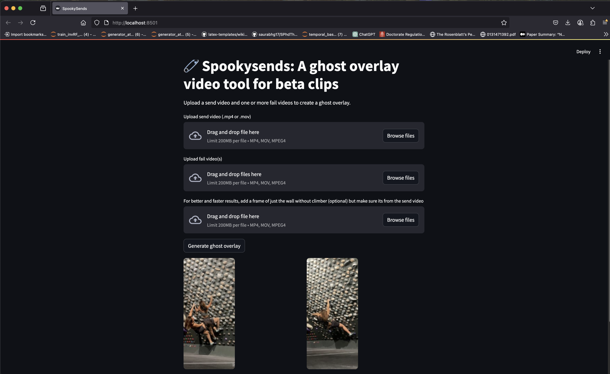

# SpookySends UI

SpookySends UI is a visual tool that overlays failed climbing attempts as transparent ghosts on top of a successful send video. It captures the process of projecting a climb and turns it into a visual story that celebrates the effort, not just the outcome.



## Background

I started this project after recording multiple sessions on the Tension Board. Like many climbers, I had a long send video and a bunch of short fail clips. I wanted a way to combine them into something more expressive, to test out new and creative ways of showcasing movement on the wall, without manually editing each one. This led me to write an algorithm that aligns, segments, and overlays my previous attempts into one video. The result shows my failed selves “haunting” the wall as I complete the climb, similar to the ghost replay concept in Mario Kart.

<div style="display: flex; gap: 10px;">
  
  
</div>

## What it does

You upload one video of your successful send and one or more short clips where you fell at specific points during earlier attempts. The system does not automatically align them in time. Instead, you define the timestamps in the send video where each fail should appear. The system then

- Segments the climber in each fail clip using a YOLO-based AI model
- Aligns each fail spatially with the send using homography matrices
- Applies temporal smoothing to reduce flickering
- Overlays each fail as a transparent figure at the specified time

The result is a climbing video that tells a fuller story. Your ghosts appear exactly where you struggled before and disappear as the send continues.

## Current features

- Upload a send and multiple fail clips
- Manual timestamp-based alignment of fails
- YOLO-based climber segmentation
- Motion-based smoothing of alpha masks
- Homography-based spatial alignment
- Transparent overlays of fail clips at defined positions
- Simple interface to manage clips and preview results

## How to run

### Requirements

- Python 3.9 or higher
- ffmpeg installed and available in your system path
- pip (virtualenv recommended)

### Installation

Clone the repository

`git clone https://github.com/lelynn/spookysends.git
cd spooky-send-ui`


Install dependencies

`pip install -r requirements.txt`


Run the app

`python app.py`


Then go to `http://localhost:5000` in your browser

## Folder structure


```text
spooky-send-ui/
├── frontend/                   Frontend assets (images, JS, CSS)
│   ├── imgs/                   UI and README images
├── static/
│   └── temp_sessions/          Temporary directories created per session
│       └── <session_id>/       Workspace with all intermediate and output files
│           ├── fail0/                  
│           ├── fail0_alpha/          
│           ├── fail1/                 
│           ├── fail1_alpha/          
│           ├── output/                Final ghosted frames and video
│           ├── send_frames/          Extracted frames from send video
│           ├── background_video.mp4  Looping base video for overlay
│           ├── background.jpg        Reference frame for alignment
│           ├── fail_0.mp4            User-uploaded fail clips
│           ├── fail_1.mp4            
│           ├── send_video.mp4        User-uploaded send video
│           └── yolov8n-seg.pt        Segmentation model checkpoint
├── templates/                  HTML templates for the web UI
├── app.py                      Flask backend
├── overlay_pipeline.py         Core overlay logic (segmentation, alignment)
├── requirements.txt            Python dependencies
└── README.md
```

This project is in early stages but already works for short bouldering clips. A more robust UI is being developed to allow full trimming control, drag and drop uploads, ghost opacity settings, and better error handling.